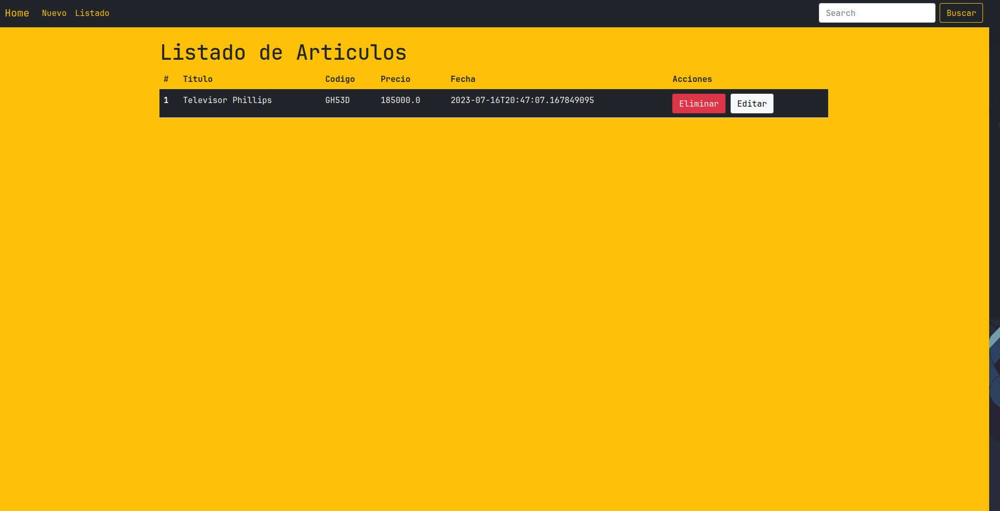

# Proyecto Final - CaC Java 2023

## 

Hola mucho gusto! Mi nombre Santiago Aquino de la comision #23049 y
vengo a mostrarles mi proyecto final del programa codo a codo. Es
un proyecto en el cual se puede crear, actualizar, eliminar y
listar (CRUD) articulos que vienen directo de una base de datos
MySQL. Esta hecho en Java con maven y usando un servidor llamado
Tomcat en la version 10.

## Herramientas utilizadas

- 

- 

- 

- 

## Captura del Proyecto

- [Link al video del proyecto](https://www.youtube.com/watch?v=s8owFe2LzoQ)

## Autor

- [@Santiaquino](https://github.com/Santiaquino)
